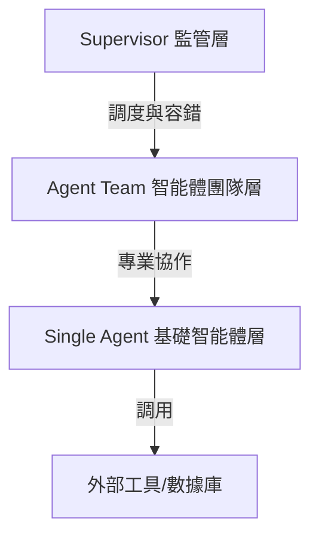

# 會議記錄與教程整理：生醫知識圖譜構建之多智能體系統 (Demo 2)

本文件整理自 Demo 2 演示會議記錄檔案 [session01_demo02.txt](file:///d:/Dropbox/2026_ismb26/%E6%9C%83%E8%AD%B0%E8%A8%98%E9%8C%84/Tutorial%20IP1%20Agentic%20AI%20System%20for%20In%20Silico%20Team%20Science%20From%20LLM%20Basics%20to%20Lab%20Assistant%20Agents%201/session01_demo02.txt)。

---

## 📅 演示基本資訊
*   **主題**：利用多智能體系統進行生醫知識圖譜的自動化構建與對齊 (Biomedical Knowledge Graph Construction & Alignment)
*   **核心目標**：解決生醫數據庫整合時，面臨的多源詞彙不一致、接口多樣、版本過時以及需長時間人工判斷等痛點。
*   **核心對比**：
    *   **傳統人工方式**：需花費 **3 至 6 個月** 進行數據清理、本體對齊與結構化整合。
    *   **多智能體系統**：僅需 **2 小時**，Token 成本約 **$30 美元**，極大地加速了科學發現與藥物重定位（Drug Repurposing）的進程。

---

## 🔍 生醫知識圖譜 (Knowledge Graph) 構建的痛點
1.  **實體對齊難度高**：不同數據庫對同一化合物或基因的命名（Vocabulary）不同（如不同 Entrez Gene ID、基因縮寫與化學符號）。
2.  **數據接口多樣**：有些需要 API，有些需要 MySQL 連接。
3.  **信息時效與錯誤**：傳統數據庫更新滯後且含有大量噪聲，需要具備專業知識的人員在每一步進行質量把控。
4.  **傳統腳本（Script）的脆弱性**：寫死（Hardcoded）的數據庫整合腳本極易因數據庫 Schema 的小改版或格式變更而崩潰。

---

## 🏗️ 多智能體系統的三層架構設計

為了解決上述「長路徑（Long-horizon）、需要決策且需具備容錯性」的任務，系統設計了三層架構：

### 1. 基礎智能體層 (Single Agent Layer)
*   **定位**：最基礎的執行單元，將推理能力與工具執行相結合。
*   **核心技能 (Skills)**：每一個智能體具備標準技能包，包含技能名稱、描述、作者與代碼指令。
*   **工具調用**：能調用 Python 執行環境或直接連接資料庫。

### 2. 智能體團隊層 (Agent Team Layer)
*   **定位**：由多個專科智能體組成的協作團隊。
*   **必要性**：由於任務極為複雜，單一語言模型無法承載全部上下文（Context）。因此需要專家智能體各自負責其專長領域（如數據讀取、概念映射、實體對齊）。

### 3. 監管層 (Supervisor Layer)
*   **定位**：團隊的協調中樞。
*   **核心功能**：
    *   **任務調度**：根據各智能體的反饋，決定下一步走向。
    *   **自動錯誤恢復與檢查點 (Checkpointing)**：當管線出錯（如 Parser 崩潰或輸出為空）時，利用 ReAct（Reason + Act）框架捕捉 Traceback（錯誤回溯），自動調整指令並重試，無需人工干預。

---

## ⚙️ 知識圖譜構建的自動化流程

1.  **步驟一：數據源識別與提取 (Source Identification)**
    *   智能體自動識別特定疾病（如阿茲海默症）的代表性數據源與文獻。
    *   智能體調用工具（API/SQL）連接數據庫並提取原始數據。
2.  **步驟二：實體解析與 ID 對齊 (Entity Resolution & Harmonization)**
    *   數據源通常使用不同的 Schema。
    *   智能體團隊根據本體（Ontology）約束，對基因、藥物和疾病進行跨引用（Cross-reference）Schema 映射。
    *   區分主要識別碼（Primary Identifier）與次要識別碼（Secondary Identifier），並將其統一轉換為相同命名系統。
3.  **步驟三：質量控制與回溯修復 (Quality Control & Traceback Recovery)**
    *   **評估智能體 (Evaluator Agent)** 負責審計輸出數據。
    *   若在分析或數據對齊過程中偵測到錯誤，系統會自動啟動 React 框架，由錯誤恢復機制進行補救（例如調整對齊邏輯、修復格式錯誤）。若評估智能體給出 hard failure，則會凍結該分支以防出錯數據污染圖譜。
4.  **步驟四：寫入圖譜與推理應用**
    *   將最終數據統一寫入知識圖譜（節點代表實體，邊代表關係）。
    *   **推理與藥物重定位**：圖譜構建完成後，智能體可以自動在圖譜上進行路徑遍歷與關聯預測。例如：發現藥物 A 被批准用於患者 A，且在阿茲海默症路徑上與新靶點共享通路，從而預測並推薦該藥物可用於新適應症。

---

## 📊 系統成效與審計

*   **高效率與低成本**：將原本需要 3-6 個月的人工整理工作縮短至 **2 小時**，且 Token 花費僅約 **$30 美元**。
*   **可審計性 (Auditable Trail)**：用戶可以在 UI 界面上完整審計每個智能體的操作紀錄與決策依據（Audit what happened），提供高度的透明性，讓科學研究步驟有跡可循。

---

## 🔗 相關開源專案與 Repository

本演示涉及 Jason H. Moore 教授團隊（Epistasis Lab）所研發的以下核心開源專案：

*   **多智能體發現框架**：[EcoXAI (EpistasisLab/EcoXAI)](https://github.com/EpistasisLab/EcoXAI) —— 自動化端到端生醫發現的多智能體框架，利用隔離的 Docker 容器和 AI 智能體（Claude Code）進行資料處理與決策。
*   **知識圖譜推理引擎**：[KRAGEN (EpistasisLab/KRAGEN)](https://github.com/EpistasisLab/KRAGEN) —— 整合知識圖譜與向量資料庫的檢索增強生成（RAG）引擎，使用 Graph-of-Thoughts 框架與 React 可視化界面。
*   **阿茲海默症知識庫**：[AlzKB (EpistasisLab/AlzKB)](https://github.com/EpistasisLab/AlzKB) —— 專門針對阿茲海默症的生醫知識圖譜，包含基因、藥物與疾病關聯，作為智能體的基礎領域知識庫。

---
*整理時間：2026-07-12*
